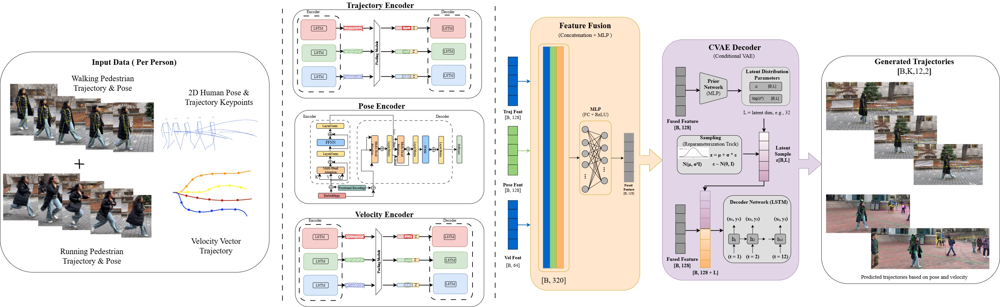

<div align="center">
<h1> PGTP-Net:<br>  Pose-Guided Trajectory Prediction Network </h1>
<h3>Sai Jayakar Vanam, Rithvik Shivva, Umar Hassan Makki Mohammad, Priyanka Lakariya
</h3>
<h4> <i> ME5550 Mobile Robotics, Northeastern University, Boston </i></h4>

[[Paper](https://drive.google.com/file/d/1iJI7K4tVCSCr35mgh5IF3osNrfcLU3Rl/view?usp=sharing)]

<image src="assets/intro_overview.jpg" width="700">

</div>

<div align="center"> <h3> Abstract </h3>  </div>
<div align="justify">

Understanding human motion behaviour is paramount for safe navigation of autonomous platforms. Traditional trajectory prediction relies predominantly on observed 2D position history, which inherently fails to capture subtle, anticipatory cues regarding pedestrian intent. We present PGTP-Net, a real-time multi-modal trajectory prediction system that leverages estimated 3D human pose and shape features to anticipate movement intentions 0.8-1.0 seconds earlier than position-only methods. Our dual-stream architecture combining Social-LSTM with Transformer-based pose encoding achieves 35-46% error reduction on JTA dataset with ground-truth 3D poses and 25-28% improvement on ETH/UCY with estimated 2D poses, while maintaining real-time performance suitable for autonomous navigation applications.
</br>

# Key Insight
<div align="center">

> *Human body pose reveals movement intent 0.5-1.2 seconds before that intent translates into a change in trajectory.*

</div>

Traditional methods treat pedestrians as point masses, discarding ~90% of available visual information about body configuration. PGTP-Net captures pre-movement postural adjustments—torso rotation, weight shifting, forward lean—that signal intent before trajectory changes occur.

# Getting started
Install the requirements using `pip`:
```
pip install -r requirements.txt
```
# Architecture

<div align="center">

</div>
PGTP-Net Architecture. The network processes past trajectories, 3D human poses, and velocity cues through dedicated LSTM and Transformer encoders. Features are fused via concatenation + MLP, then fed to a CVAE decoder to generate K=20 diverse future trajectories.

# Data
Our research hypothesis is that body pose reveals movement intent before trajectory changes. To rigorously validate this, we required datasets with specific characteristics like(Trajectory, 2D/3D pose, and 2D/3D human keypoints of a single person in every frame)


## JTA (Joint Track Auto)
We chose JTA as our primary dataset because it uniquely provides both trajectory and 3D pose ground-truth in realistic urban scenarios. The JTA dataset is a large-scale synthetic dataset generated from GTA V, providing ground-truth 3D pose annotations.

Download the dataset from [here](https://aimagelab.ing.unimore.it/imagelab/page.asp?IdPage=25). 

1. Download the data and place the raw data subdirectory of data under `data/raw/jta/`

2. Extract the JTA data: Extract annotations from JSON files
   ```
   python scripts/preprocess_jta.py --input_dir data/raw/jta --output_dir data/processed/jta --obs_len 8 --pred_len 12
   ```
## ETH/UCY Dataset
The ETH/UCY dataset is a real-world pedestrian trajectory benchmark consisting of 5 scenes.
Please download the raw data [here](https://github.com/StanfordASL/Trajectron-plus-plus/tree/master/experiments/pedestrians/raw).

1. Download the data and place the raw data subdirectory of data under `data/raw/eth_ucy/`
   
3. Preprocessing the data: We convert the pixel coordinates to world coordinates
   ```
   python scripts/preprocess_eth_ucy.py --input_dir data/raw/eth_ucy --output_dir data/processed/eth_ucy --obs_len 8 --pred_len 12
   ```
## Human3.6M (3D pose estimation)
Used to validate our 3D pose estimation pipeline (RTMPose + SMPL fitting).
Before you download, please request access to the data from [here](http://vision.imar.ro/human3.6m/).
1. After getting the access, download the specific subjects S1, S5, S6, S7, S8 for training & S9, S11 for testing.
2.  Place the raw data subdirectory of data under `data/raw/human36m/`
3.  We use this data for validating our pose estimation accuracy , we get output in form of MPJPE (Mean Per Joint Position Error) in mm
   ```
python scripts/validate_smpl.py --input_dir data/raw/human36m --subjects S9 S11 --output_dir outputs/pose_validation
   ```

# Training and Evaluation 
The code is using pytorch DDP so that it can be easily deployed on multiple gpus.

command for training on JTA with 3D poses:
```
python train.py --config configs/jta_3d_pose.yaml --output_dir outputs/jta_exp
```
command for training on ETH/UCY with 2D poses:
```
python train.py --config configs/eth_ucy_2d_pose.yaml --output_dir outputs/eth_exp

```

command for evaluating on JTA / ETH/UCY 
```
python evaluate.py --model_path models/pgtp_{data_name}_best.pt --dataset {data_name} --num_samples 20
```


# Work in Progress
Since it's still a  work-in-progress, integrating the 3D pose and trajectory from Humane3.6 m might take a while, as the data is a lot, and it's only used in SMPL validation for now. Pre-trained and fine-tuned models will take a while to be released.

Please find the results of the model in the paper. The first model, which is trained on ETH/UCY( only Trajectory), has baseline results, and when trained on (trajectory + 2D point), we see a ~25% improvement. The second model - trained on JTA(Trajectory + Velocity + 3D pose) gives us the best accuracy compared with the current Social-LSTM/GAN's. 

